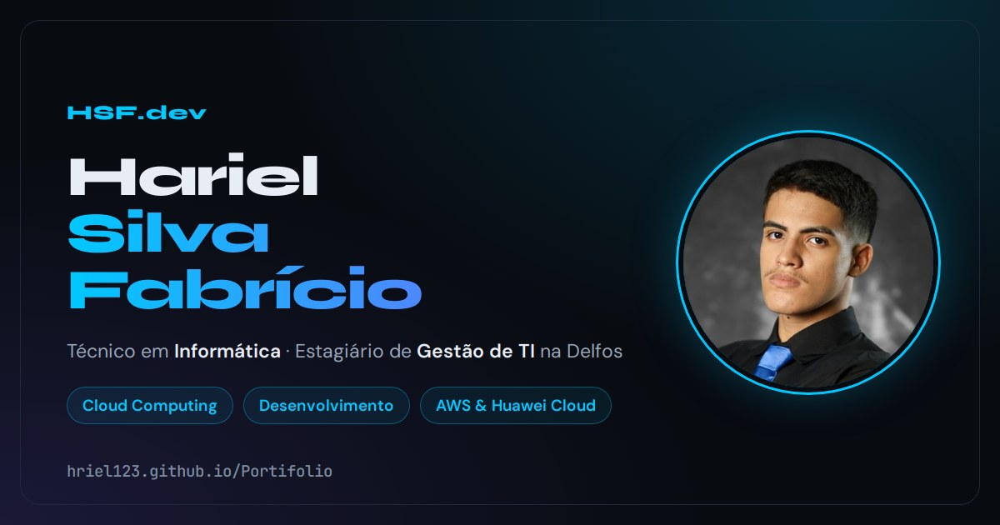

# Portfólio · Hariel Silva Fabrício



**Site:** https://hriel123.github.io/Portifolio/
**Currículo:** https://hriel123.github.io/Portifolio/curriculo.html (com download em PDF)

Portfólio pessoal de um estudante do Técnico em Informática (E.E.E.P. Edson Queiroz, Cascavel-CE), estagiário de Gestão de TI, com foco em Cloud Computing, desenvolvimento e AWS & Huawei Cloud.

## O que tem no site

- **Sobre:** áreas de interesse e atuação.
- **Experiência & Formação:** linha do tempo interativa de 2024 a 2026, com filtros (experiência, formação, certificações), destaques que abrem e fecham e acesso direto aos certificados.
- **Projetos:** FinFlow, FilaFácil e JLVariedades, cada um com galeria de telas e link para o projeto no ar.
- **Certificados:** 7 certificados, com a imagem do certificado, o PDF original e, quando existe, o link de verificação.
- **Habilidades e Contato.**
- **Currículo:** página própria em formato A4, com o PDF gerado a partir dela.

## Recursos

- Tema claro e escuro, com a escolha salva no navegador.
- Responsivo de 320px a telas grandes, com menu próprio para celular e tablet.
- Acessibilidade: navegação por teclado, foco visível, textos alternativos nas imagens, contraste AA nos dois temas e respeito à preferência por menos movimento.
- Funciona mesmo sem JavaScript (o conteúdo continua visível).
- Imagem de prévia para links compartilhados (WhatsApp, LinkedIn etc.).

## Tecnologias

HTML, CSS e JavaScript puros, sem frameworks nem etapa de build. Hospedado no GitHub Pages.

## Estrutura

```
index.html                         página principal
curriculo.html                     currículo (fonte do PDF)
curriculo-hariel-silva-fabricio.pdf
certificado_*.pdf                  certificados originais
assets/projetos/                   telas das galerias dos projetos
assets/certificados/               imagens dos certificados
assets/curriculo/                  foto do currículo
assets/og/                         imagem de prévia e a página que a gera
```

## Rodar localmente

```bash
python3 -m http.server 8000
```

Depois abra http://localhost:8000.

## Arquivos gerados

Alguns arquivos são gerados a partir de outros e precisam ser refeitos quando a fonte muda (com o servidor local rodando):

- **PDF do currículo** (depois de mudar `curriculo.html`):

  ```bash
  google-chrome --headless=new --no-pdf-header-footer \
  --print-to-pdf=curriculo-hariel-silva-fabricio.pdf \
  http://localhost:8000/curriculo.html
  ```

- **Imagem de prévia** (depois de mudar `assets/og/card.html`), em 1200x630, convertida depois para JPG:

  ```bash
  chrome-headless-shell --hide-scrollbars --window-size=1200,630 \
  --screenshot=og.png http://localhost:8000/assets/og/card.html
  ```

- **Imagens dos certificados** (ao trocar ou adicionar um PDF): renderizar as páginas com `pdftoppm`, converter para WebP em `assets/certificados/<chave>-<página>.webp` e registrar o tamanho em `CERT_IMAGES` no `index.html`.

## Contato

- LinkedIn: https://www.linkedin.com/in/h%D0%B0riel-silva-fabr%C3%ADcio-1b1004353/
- GitHub: https://github.com/hriel123
